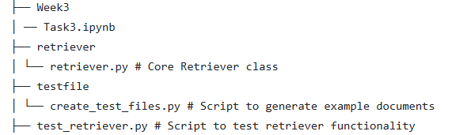

# 🧠 Document Retriever with FAISS and Sentence Transformers

This project provides a lightweight document retrieval system powered by [Sentence-Transformers](https://www.sbert.net/) and [FAISS](https://github.com/facebookresearch/faiss). It supports searching across `.txt`, `.md` documents using semantic similarity.

---

## 📁 Project Structure

---
## 🔧 Installation

Make sure you have Python 3.7+ and install dependencies using pip:

%pip install openai sentence-transformers faiss-cpu hf_xet

## 🧪 Features
✅ Supports .txt, .md we tried to do pdf but it doesn't work due to package error

✅ Fast similarity search with FAISS

✅ Metadata tracking

✅ Persistent save/load of index

## 🛠️ Usage
 🧪 Testing via Script
Run the following in your terminal:

python testfile/create_test_files.py   
python test_retriever.py  
